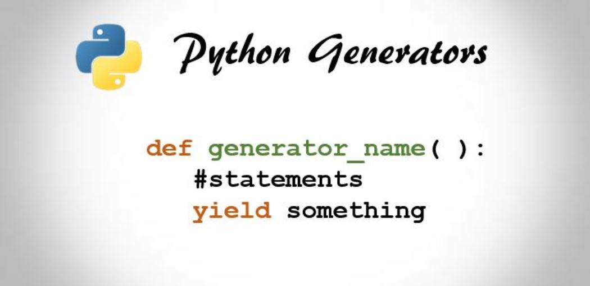

# Python Concepts for Data Science : Generators

 
 This project is part of the [Data Insight Program](https://www.datainsightonline.com/).
 Here, I describe in detail the concept of **Generators in Python**, how and when to use them as well as when to avoid.
